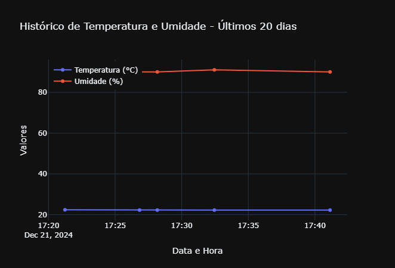

# Captura de informações de clima

Projeto para captura de informações climáticas e visualização em gráfico com Plotly

## Utilização
#### 1. Clonar o repositório em seu diretório:
```bash
git clone https://github.com/danaraujo1/captura_clima
```

#### 2. Criar um ambiente virtual dentro do diretório:
```python
python -m venv _env
```

#### 3. Ativar o ambiente virtual:
```python
_env/Scripts/activate
```

#### 4. Instalar o pacote de bibliotecas (`requirements.txt`) para utilizar a aplicação Streamlit:
```python
pip install -r requirements.txt
```

#### 5. Executar a aplicação no seu ambiente:
```python
py script.py
```

## Visual final (Gráfico com informações geradas)

